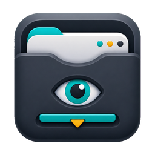

# PeekDock

<p align="center">
  
</p>

PeekDock is a lightweight Windows utility that turns one existing Chrome window into a quick hide/restore dock. It binds the active Chrome tab and preserves that same window, page state, playback position, and form state.

## Features

- Bind the current Chrome tab instead of hard-coding a URL.
- Show, hide, and restore the original bound Chrome window.
- Keep the page state alive by hiding instead of closing.
- Configure hotkeys from a small native settings window.
- Toggle always-on-top.
- Start with Windows.
- Build a standalone exe with AutoHotkey v2.
- Uses a custom PeekDock icon for the app window, tray, shortcuts, and README.

## Quick Start

1. Install AutoHotkey v2 if you want to run from source.
2. Run `PeekDock.ahk`, or run `dist\PeekDock.exe` after building.
3. Open the target page in Chrome.
4. Resize and position the Chrome window the way you want.
5. Click `Bind Current Chrome Tab`.
6. Use the configured dock hotkey, or click `Show / Hide Dock`, to show or hide PeekDock.

## Default Hotkeys

| Action | Default |
| --- | --- |
| Show / hide / restore dock | Middle mouse button |
| Bind current Chrome tab | `Ctrl + Alt + Shift + B` |
| Toggle always-on-top | `Ctrl + Alt + T` |

## Build an exe

```powershell
powershell -NoProfile -ExecutionPolicy Bypass -File .\scripts\build.ps1
```

The executable is written to `dist\PeekDock.exe`. The compiled app still requires Chrome to be installed.

## Build a one-click installer

```powershell
powershell -NoProfile -ExecutionPolicy Bypass -File .\scripts\build-installer.ps1
```

The installer is written to `dist\PeekDock-Setup.exe`. It installs the bundled PeekDock script to `%LOCALAPPDATA%\PeekDock`, checks for Chrome and AutoHotkey v2, installs missing dependencies with winget when available, falls back to the official AutoHotkey GitHub installer if winget cannot install AutoHotkey, creates Desktop and Start Menu shortcuts, and starts PeekDock.

## 中文补充

PeekDock 是一个轻量级 Windows 小工具，用来把当前已经打开的 Chrome 窗口绑定成可快速隐藏/恢复的小窗。它会保留原页面、播放进度和输入状态，不会再复制打开一个新的 Chrome 页面。`PeekDock-Setup.exe` 是一键安装器，会检查并安装需要的 Chrome 和 AutoHotkey v2 环境。

## Privacy

PeekDock stores the bound URL, hotkeys, startup preference, and runtime window handle in local `config.ini`. The dedicated Chrome profile lives in `browser-profile/`. Both are excluded from Git.

## License

MIT
